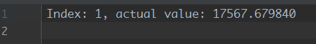
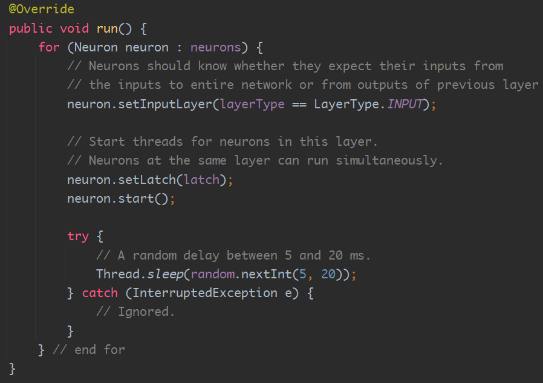

### 9869 Practice: Simple Neural Network

Student Number: 202191382 (zguan#mun.ca)

### Question: Can you reuse your synchronization mechanism? Why or why not?

I think yes. On each `run` of the layer 
I create a new `CountDownLatch` and wait forever until all neurons are done.
After that the next layer can proceed.
Therefore, although we run the same network in many threads at the same time,
the synchronization mechanism should still work.

See `Concurrent Design` part for detailed explanation.

### Configurable Items

- Input Layer Size (Number of neurons, default = 4)
- Internal Layer Size (Default = 5)
- Output Layer Size (Default = 3)
- Activation Function (Defualt = ReLU)

### Concurrent Design

Neurons in the same layer can run simultaneously, 
as they do not interfere each other.

However in the layer level, each neural layer must be run one-by-one. 
We have a `CountDownLatch` with capacity = `Layer Size` for each layer.

Above is the `run` method in NeuralLayer.
